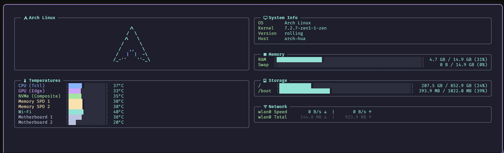

# easyfetch

<p align="center">
  <strong>A fast, lightweight, and modern terminal system monitor and fetch dashboard written in Rust.</strong>
</p>

<p align="center">
  
  
  
  
  
</p>

---

## 🌟 Highlights

- ⚡ **Blazing Fast & Zero Heavy Crates**: Gathers hardware metrics directly via the Linux kernel's native `/proc` and `/sys` interfaces. No bloated monitoring libraries—instant compile times and sub-millisecond tick latency.
- 🎨 **Fastfetch-Style ASCII System**: Supports multi-color tokens (`$1`, `$2`), custom distro logos, customizable color palettes, and external custom art files.
- 🖥️ **Adaptive TUI Layout**: Automatically reorganizes panels into dual-column, single-column, or compact merged views based on terminal window dimensions.
- 📊 **High-Precision Visual Gauges**: Smooth progress bars with eighth-block resolution (`▏▎▍▌▋▊▉█`) for RAM, Swap, Storage, and Temperature sensors.
- 🌡️ **Smart Hardware Temperature Monitoring**: Automatically translates cryptic kernel driver paths into intuitive labels (`CPU (Tctl)`, `GPU (Edge)`, `NVMe (Composite)`, `Memory SPD`, `Wi-Fi`, `Motherboard`) with dynamic thermal color warnings.
- ⚙️ **Simple TOML Configuration**: Easily customize refresh rates, ASCII logos, modes, and color palettes via standard `config.toml`.
- 🪶 **Self-Contained Single Binary**: Weighs in at only ~1.6 MB with fallback embedded ASCII assets.

---

## 📸 Preview

<p align="center">
  
</p>

---

## 🚀 Installation

### Building from Source

Ensure you have a modern Rust toolchain installed (1.85+ recommended):

```bash
# Clone the repository
git clone https://github.com/hamzaoguzalp/easyfetch.git
cd easyfetch

# Build release binary
cargo build --release

# Install to ~/.cargo/bin (make sure it is in your $PATH)
cargo install --path .
```

The compiled binary will be placed at `target/release/easyfetch`.

---

## 🕹️ Usage

Run `easyfetch` directly from your terminal:

```bash
easyfetch
```

### Command Line Options

```bash
easyfetch [OPTIONS]

Options:
  -s, --system        Run system monitor dashboard
  -t, --time <TIME>   Refresh interval in seconds [default: 1]
      --gen-config    Generate default config file in ~/.config/easyfetch/config.toml
      --print-config  Print default config to stdout
  -h, --help          Print help
  -V, --version       Print version
```

---

## ⚙️ Configuration

`easyfetch` works out of the box with zero setup, but can be fully customized! It searches for a configuration file in the following order:

1. `./easyfetch.toml` (Current working directory override)
2. `$XDG_CONFIG_HOME/easyfetch/config.toml`
3. `~/.config/easyfetch/config.toml`

To quickly generate a default configuration file with full documentation and comments:

```bash
easyfetch --gen-config
```

Or view/pipe the default template:

```bash
easyfetch --print-config
```

### Configuration Options

```toml
# easyfetch configuration file (~/.config/easyfetch/config.toml)

# Refresh interval in seconds (default: 1)
refresh_interval = 1

[logo]
# ASCII Art Source:
# - "auto" (default): Automatically detects current OS distro
# - Distro preset name: "arch", "ubuntu", "debian", "fedora", "void", "linux", "macos"
# - File path: Path to custom ASCII art file (e.g. "~/.config/easyfetch/my_art.txt")
source = "auto"

# Display Mode:
# - "auto" (default): Dynamically adapts based on terminal size
# - "full": Always show full ASCII art
# - "compact": Always show compact ASCII art
# - "none" or "off": Disable ASCII art entirely
mode = "auto"

# Color Palette:
# Maps to $1, $2, $3... placeholders in ASCII art files.
# Supported colors:
#   "black", "red", "green", "yellow", "blue", "magenta" (or "purple"),
#   "cyan", "white", "grey" (or "dark_grey"), "light_red", "light_green",
#   "light_yellow", "light_blue", "light_magenta", "light_cyan"
colors = ["cyan", "blue"]
```

### Fastfetch-Style Color Tokens in ASCII Art

ASCII art files support multi-color tokens:
- `$1` switches the foreground color to the 1st palette color (`colors[0]`).
- `$2` switches to the 2nd palette color (`colors[1]`).
- `$3` switches to the 3rd palette color, and so on.
- `$$` escapes to a literal `$` sign.

You can also drop custom distro art files into `~/.config/easyfetch/ascii/<distro>.txt` or `~/.config/easyfetch/ascii/<distro>_compact.txt` to override built-in art without recompiling!

---

## 🔍 How It Works (Native `/proc` & `/sys`)

Unlike many system monitors that pull in heavy multi-platform dependencies, `easyfetch` directly queries the Linux kernel virtual filesystems:

| Metric | Source |
| :--- | :--- |
| **System Info** | `/etc/os-release`, `/proc/sys/kernel/osrelease`, `/proc/sys/kernel/hostname` |
| **Memory & Swap** | `/proc/meminfo` (`MemTotal`, `MemAvailable`, `SwapTotal`, `SwapFree`) |
| **Hardware Temperatures** | `/sys/class/hwmon/hwmon*` (`temp*_input`, `name`, `temp*_label`) |
| **Filesystems & Storage** | `/proc/mounts` + `libc::statvfs` (with btrfs subvolume deduplication) |
| **Network Throughput** | `/proc/net/dev` (realtime delta calculations for Rx/Tx speed) |

---

## 🤝 Contributing

Contributions, issues, and feature requests are welcome! Feel free to check the [issues page](https://github.com/hamzaoguzalp/easyfetch/issues).

1. Fork the Project
2. Create your Feature Branch (`git checkout -b feature/AmazingFeature`)
3. Commit your Changes (`git commit -m 'Add some AmazingFeature'`)
4. Push to the Branch (`git push origin feature/AmazingFeature`)
5. Open a Pull Request

---

## 👤 Author

- **Hamza Oğuzalp** — GitHub: [@hamzaoguzalp](https://github.com/hamzaoguzalp)
